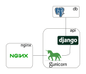

## General architecture of WebMEV

The WebMEV application is architected as a collection of Docker images which is orchestrated/managed by `docker-compose`.

The application includes three containers with the following responsibilities.

- `nginx`: Handles communication to the outside world. Serves static files directly and forwards other requests to the application server (gunicorn), which is packaged in the `api` container.

- `db`: The database container. Currently using postgres as we require saving of JSON-format data structures

- `api`: The main application container. This container wraps several components, including the web application (written in Django), redis for cache and job queueing, and gunicorn as the application server.

To allow sharing of files/resources between containers, we make use of Docker volumes. For instance, we use a Docker volume to share static files between the `nginx` and `api` containers. Additionally, we use Docker volumes to preserve the database and other required files in the event where we only need to update the application code (e.g. for a bug fix).
